## SpringBoot+Vue.js应急物资调度系统(调度算法) 应急物资保障系统

## 要求
源码一套有偿(论文 开题报告  文献综述  源码+sql脚本)
加好友前帮忙start一下，并备注github有偿获取源码
我的QQ号是2877135669或者2827724252
加qq好友说明（被部分 网友整得心力交瘁）：
    1.加好友务必按照格式备注
    2.避免浪费各自的时间！
    3.当“客服”不容易，repo 主是体面人，不爆粗，性格好，文明人。

https://www.bilibili.com/video/BV1A54y1j7NA?spm_id_from=333.999.0.0

## 功能

本系统七个部分分别是用户管理模块、用户信息模块、用户留言模块、管理员模块、图片识别模块、学习收藏模块，它们的功能如下：

（1） 用户管理模块

用户管理模块包含了注册(账号、昵称、密码)、登录（不能通过昵称去登陆，只能通过账号）、修改功能，昵称和密码可以随时修改（需要验证现有密码），而账号有修改时间限定，半年可更改一次。

（2） 用户信息模块

用户信息模块可以查看自己的登录信息（登陆时间和在线时常），也可查看自己图片识别记录。

（3） 用户留言模块

用户可以通过留言功能入口，对软件给予好的建议，留言仅自己和管理员可以看见。

（4） 管理员模块

管理员账号既可以作为普通用户去登陆进行图片识别操作，也可以通过管理员特殊登录入口登录，通过特殊登录入口登陆后的界面和普通用户的界面应不一样，它的界面应列出已注册的用户信息（账号、昵称），它的界面不需要有图片识别的功能，管理员可通过验证密码的方式对普通用户进行封号、限制图片识别的权限，也可以查看普通用户的登录信息记录、留言，为了用户隐私，管理员不可查看用户识别图像记录。

（5） 图片识别模块

通过用户插入图片等一系列操作，软件会对图片进行识别，并给出一组相似图片，相似度由高到低进行排列。（百度开放平台接口调用）

（6） 学习收藏模块

可以将自己喜欢的识别结果收藏进学习收藏夹，也可以为对应的收藏添加相应的学习感悟。

（7） 权限管理模块

权限由高到低分为超级用户、管理员、普通用户三个级别，超级用户仅有一个，在软件开发之时已创建，用户名为root，对应的有超级密码，超级用户只可以通过管理员登录入口来登录（不可通过普通登录入口进行登录），除具有管理员的权限外，还可通过验证超级密码设定某些普通用户为管理员，也可将管理员降级为普通用户，超级用户还可查看普通用户的图片识别记录。只有超级用户有修改超级密码的权力（通过验证现有超级密码）。

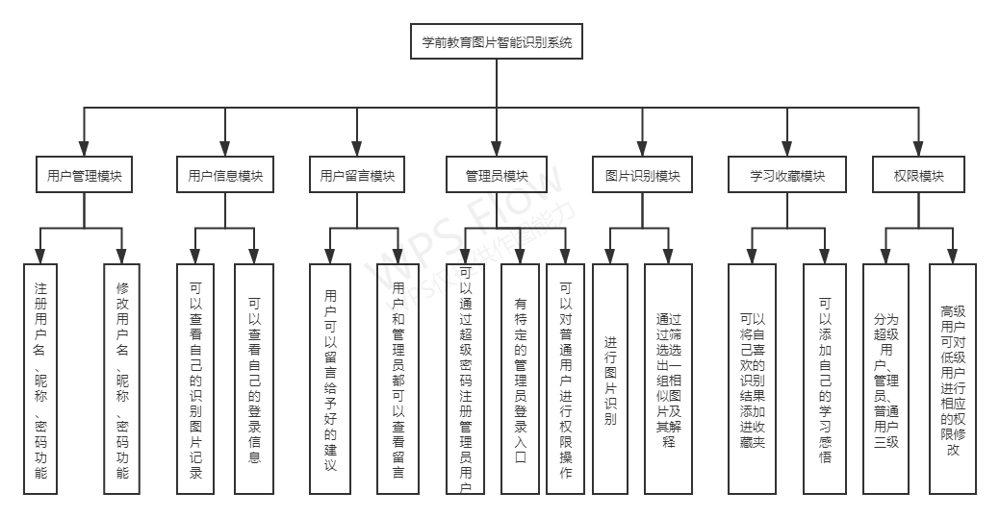

# 技术

前端：vue.js elementUI echarts

后端：springboot mybatis 百度AI平台

数据库：mysql

​	

# 运行截图

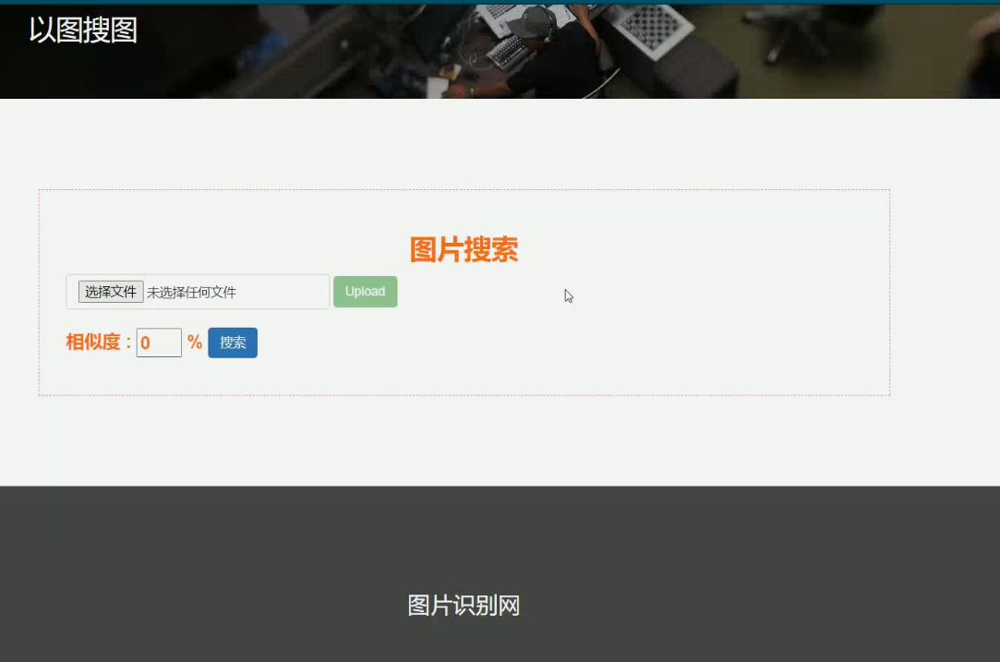

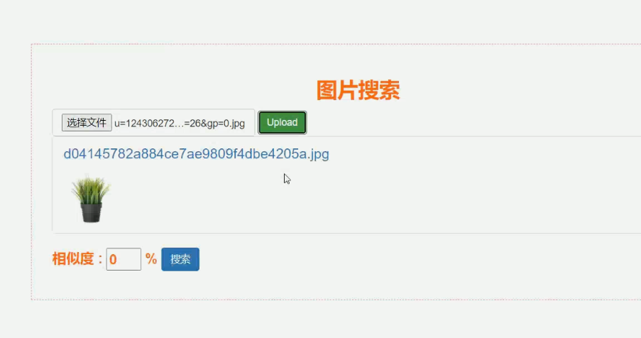

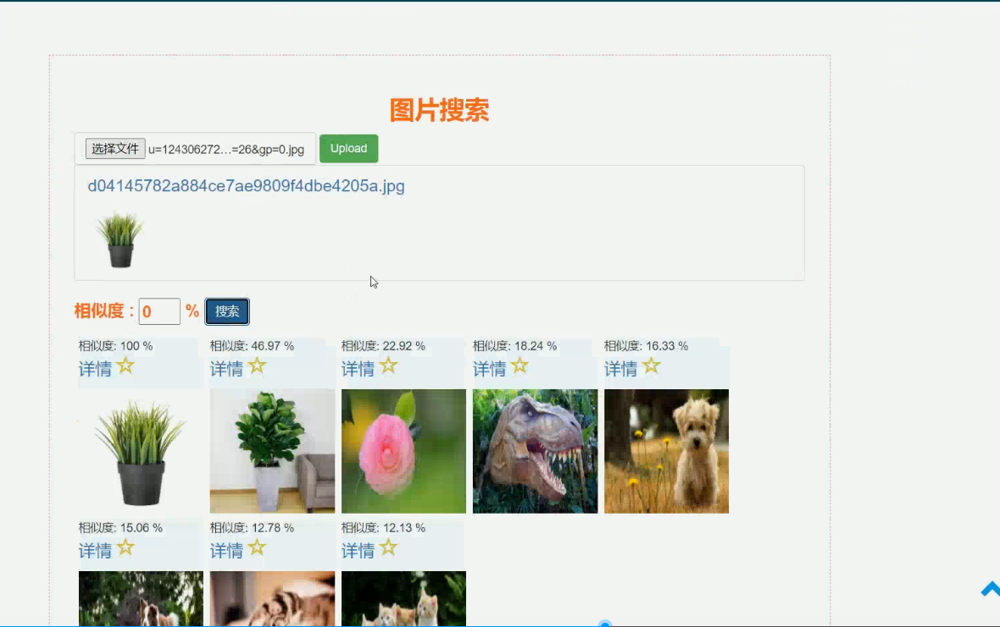

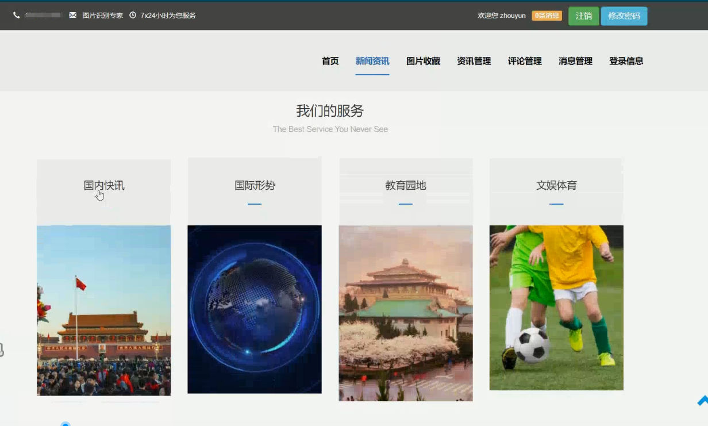

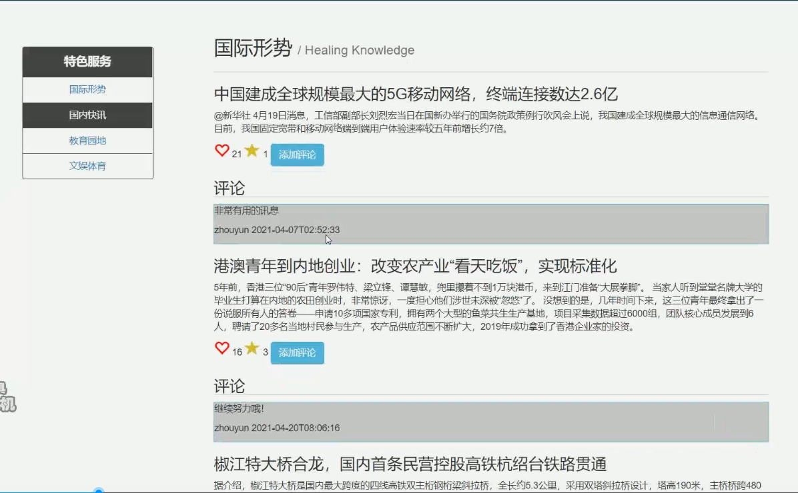

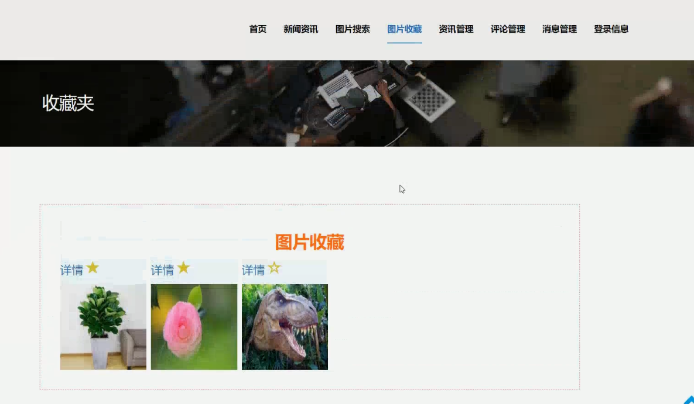

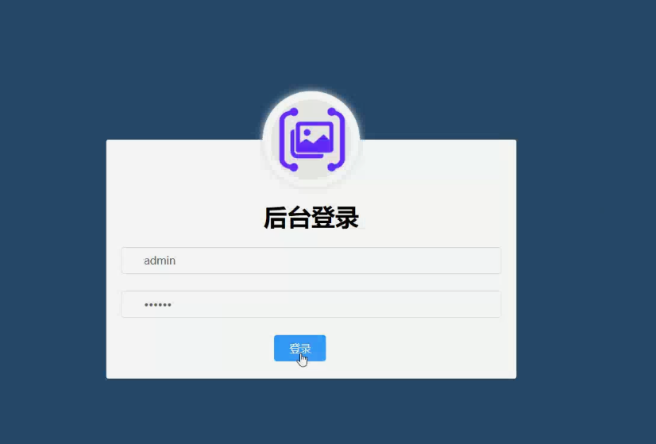

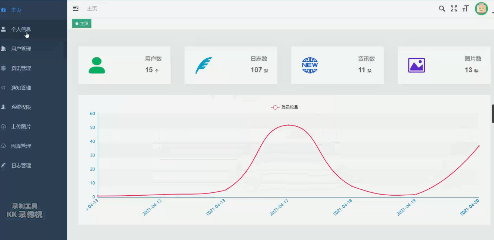

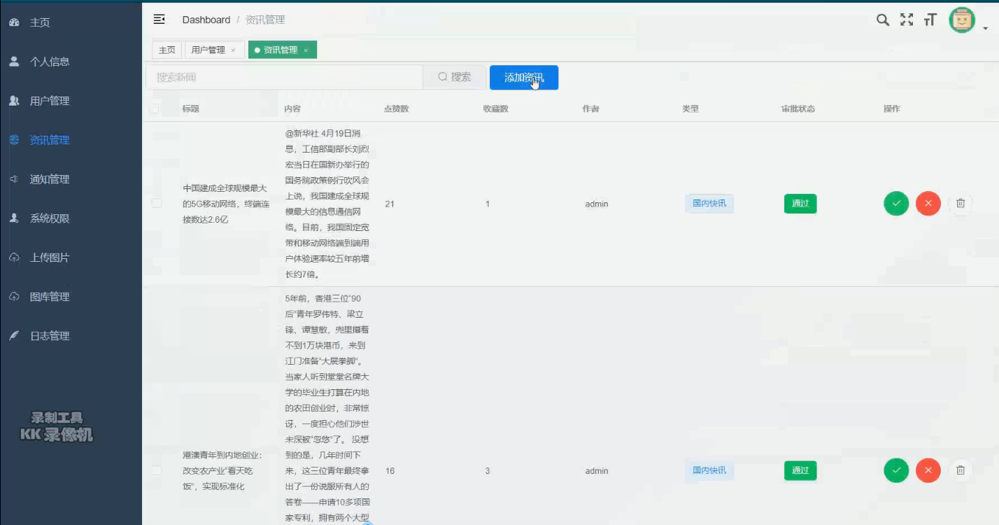

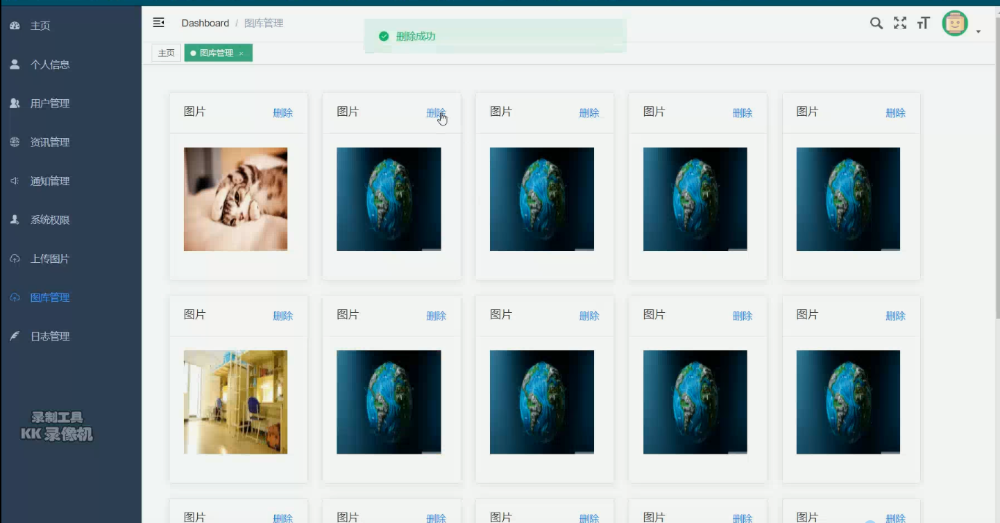

# 运行视频B站
https://www.bilibili.com/video/BV1A54y1j7NA?spm_id_from=333.999.0.0

